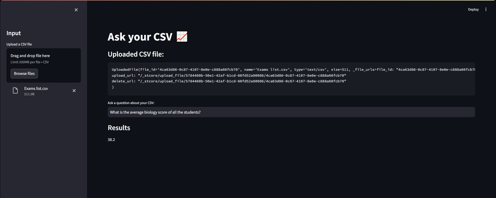

# Ask Your CSV 📈 - Streamlit Application

## Project Overview

**Ask Your CSV** is an interactive Streamlit application that allows users to upload a CSV file and ask questions about the data contained within it. The application leverages the power of OpenAI's language model to analyze the data and provide insightful answers to user queries. This tool is particularly useful for data analysis, exploration, and generating quick insights from CSV datasets.

## Features

- **File Upload**: Users can upload CSV files directly through the web interface.
- **Interactive Q&A**: Users can input questions about their data and receive detailed responses.
- **Data Display**: Uploaded CSV files are displayed in the application for quick reference.
- **Error Handling**: Robust error handling to manage issues during file processing and question analysis.
- **Environment Configuration**: Utilizes environment variables for secure API key management.

## Installation

### Prerequisites

- Python 3.7 or higher
- Pip (Python package installer)
- Streamlit library
- OpenAI API key

### Steps

1. **Clone the Repository**

    ```bash
    git clone https://github.com/yourusername/ask-your-csv.git
    cd ask-your-csv
    ```

2. **Install Required Packages**

    Install the necessary Python packages using pip:

    ```bash
    pip install -r requirements.txt
    ```

3. **Set Up Environment Variables**

    Create a `.env` file in the project root directory and add your OpenAI API key:

    ```bash
    echo "OPENAI_API_KEY=your_openai_api_key" > .env
    ```

4. **Run the Application**

    Start the Streamlit application by running:

    ```bash
    streamlit run main.py
    ```

## Usage

1. **Open the Web Application**

    Navigate to the URL provided by Streamlit (usually `http://localhost:8501`).

2. **Upload a CSV File**

    Use the sidebar to upload your CSV file. The file will be displayed on the main page upon successful upload.

3. **Ask Questions**

    Enter your question about the CSV data in the input field provided. The application will process your query and display the results.

## Project Structure

- `main.py`: The main application script.
- `requirements.txt`: A list of Python packages required to run the application.
- `.env`: Environment file to store sensitive information such as the OpenAI API key.

## Code Explanation

### `main.py`

- **set_page**: Configures the Streamlit page settings and title.
- **display_input_fields**: Manages the file uploader and user input field for questions.
- **run_agent**: Creates the CSV agent using OpenAI and processes the user’s question to generate results.
- **main**: The entry point of the application. It sets up the page, loads environment variables, and runs the core functions.



